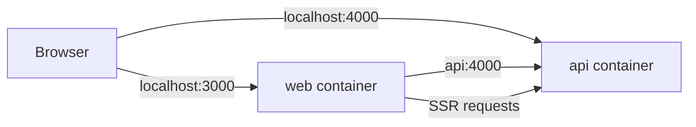

## Overview

ZeroStarter includes production-ready Docker configurations for both the frontend (Next.js) and backend (Hono API). This guide covers running the application with Docker Compose and deploying to container orchestration platforms.

## Quick Start

Run the entire stack with Docker Compose:

```bash
docker compose up
```

This starts both services:

- **Frontend**: [http://localhost:3000](http://localhost:3000)
- **Backend**: [http://localhost:4000](http://localhost:4000)

<Note>
  Ensure you have a `.env` file in the repository root with all required environment variables before running Docker Compose.
</Note>

## Docker Compose Configuration

The `docker-compose.yml` defines two services that work together:

```yaml docker-compose.yml
services:
  api:
    build:
      context: .
      dockerfile: api/hono/Dockerfile
    env_file:
      - .env
    environment:
      - INTERNAL_API_URL=http://api:4000
    ports:
      - "4000:4000"

  web:
    build:
      context: .
      dockerfile: web/next/Dockerfile
    env_file:
      - .env
    environment:
      - INTERNAL_API_URL=http://api:4000
    ports:
      - "3000:3000"
```

### Key Configuration

| Setting            | Description                                                |
| ------------------ | ---------------------------------------------------------- |
| `context: .`       | Build context is the repository root (monorepo access)     |
| `env_file: .env`   | Loads environment variables from root `.env` file          |
| `INTERNAL_API_URL` | Internal Docker network URL for service-to-service calls   |

## Docker Architecture

### Backend Dockerfile (Hono API)

The backend uses a multi-stage build with Bun runtime:

```dockerfile api/hono/Dockerfile
FROM oven/bun:latest AS base

# Prepare stage: Prune monorepo to only @api/hono dependencies
FROM base AS prepare
WORKDIR /app
RUN bun install --global turbo
COPY . .
RUN turbo prune @api/hono --docker

# Builder stage: Install dependencies and build
FROM base AS builder
WORKDIR /app
COPY --from=prepare /app/.env .
COPY --from=prepare /app/.github/ ./.github/
COPY --from=prepare /app/out/json/ .
COPY --from=prepare /app/out/bun.lock .
RUN bun install --frozen-lockfile --ignore-scripts
COPY --from=prepare /app/out/full/ .
ENV NODE_ENV=production
RUN bun run build

# Runner stage: Production runtime
FROM base AS runner
WORKDIR /app
COPY --from=builder /app/node_modules/ ./node_modules/
COPY --from=builder /app/api/hono/dist/ ./dist/
COPY --from=builder /app/api/hono/package.json .
# Shared packages
COPY --from=builder /app/packages/auth/dist/ ./packages/auth/dist/
COPY --from=builder /app/packages/auth/package.json ./packages/auth/
COPY --from=builder /app/packages/db/dist/ ./packages/db/dist/
COPY --from=builder /app/packages/db/package.json ./packages/db/
COPY --from=builder /app/packages/env/dist/ ./packages/env/dist/
COPY --from=builder /app/packages/env/package.json ./packages/env/

USER bun
CMD ["bun", "run", "start"]
EXPOSE 4000
```

### Frontend Dockerfile (Next.js)

The frontend follows a similar multi-stage pattern:

```dockerfile web/next/Dockerfile
FROM oven/bun:latest AS base

# Prepare stage: Prune monorepo to only @web/next dependencies
FROM base AS prepare
WORKDIR /app
RUN bun install --global turbo
COPY . .
RUN turbo prune @web/next --docker

# Builder stage: Install dependencies and build Next.js
FROM base AS builder
WORKDIR /app
COPY --from=prepare /app/.env .
COPY --from=prepare /app/.github/ ./.github/
COPY --from=prepare /app/out/json/ .
COPY --from=prepare /app/out/bun.lock .
RUN bun install --frozen-lockfile --ignore-scripts
COPY --from=prepare /app/out/full/ .
ENV NODE_ENV=production
RUN bun run build

# Runner stage: Production runtime
FROM base AS runner
WORKDIR /app
COPY --from=builder /app/node_modules/ ./node_modules/
COPY --from=builder /app/web/next/.next/ ./.next/
COPY --from=builder /app/web/next/package.json .
COPY --from=builder /app/web/next/public/ ./public/
# API dependency for type safety
COPY --from=builder /app/api/hono/dist/ ./api/hono/dist/
COPY --from=builder /app/api/hono/package.json ./api/hono/
# Shared packages
COPY --from=builder /app/packages/auth/dist/ ./packages/auth/dist/
COPY --from=builder /app/packages/auth/package.json ./packages/auth/
COPY --from=builder /app/packages/env/dist/ ./packages/env/dist/
COPY --from=builder /app/packages/env/package.json ./packages/env/

RUN mkdir -p .next && chown -R bun:bun .next

USER bun
CMD ["bun", "run", "start"]
EXPOSE 3000
```

<Note>
  Both Dockerfiles use Turbo's `prune` command to extract only the necessary dependencies for each service, resulting in smaller, more secure images.
</Note>

## Building Individual Images

### Backend (Hono API)

Build and run the backend container:

```bash
# Build image
docker build -f api/hono/Dockerfile -t zerostarter-api .

# Run container
docker run -p 4000:4000 --env-file .env zerostarter-api
```

### Frontend (Next.js)

Build and run the frontend container:

```bash
# Build image
docker build -f web/next/Dockerfile -t zerostarter-web .

# Run container
docker run -p 3000:3000 --env-file .env zerostarter-web
```

<Warning>
  Build commands must be run from the repository root (`.`) to access the full monorepo.
</Warning>

## Environment Variables

Create a `.env` file in the repository root with the following variables:

```bash .env
# Environment
NODE_ENV=production

# Server Configuration
HONO_APP_URL=http://localhost:4000
HONO_TRUSTED_ORIGINS=http://localhost:3000
HONO_RATE_LIMIT=60
HONO_RATE_LIMIT_WINDOW_MS=60000

# Authentication
# Generate using: openssl rand -base64 32
BETTER_AUTH_SECRET=your_secret_key_here

# GitHub OAuth
# Generate at: https://github.com/settings/developers
GITHUB_CLIENT_ID=your_github_client_id
GITHUB_CLIENT_SECRET=your_github_client_secret

# Google OAuth
# Generate at: https://console.cloud.google.com/apis/credentials
GOOGLE_CLIENT_ID=your_google_client_id
GOOGLE_CLIENT_SECRET=your_google_client_secret

# Database
POSTGRES_URL=your_postgres_connection_string

# Client Configuration
NEXT_PUBLIC_APP_URL=http://localhost:3000
NEXT_PUBLIC_API_URL=http://localhost:4000

# Optional: Analytics
NEXT_PUBLIC_POSTHOG_HOST=https://eu.i.posthog.com
NEXT_PUBLIC_POSTHOG_KEY=

# Optional: Feedback
NEXT_PUBLIC_USERJOT_URL=
```

## Internal Service Communication

When running with Docker Compose, services communicate via Docker's internal network:



- External clients connect via mapped ports: `localhost:3000`, `localhost:4000`
- The `web` service connects to `api` using `http://api:4000` (Docker DNS)
- The `INTERNAL_API_URL` environment variable enables server-side rendering to communicate directly with the API container

## Production Deployment

### Container Registry

Push images to a container registry for deployment:

<Tabs>
  <Tab title="Docker Hub">
    ```bash
    # Tag images
    docker tag zerostarter-api username/zerostarter-api:latest
    docker tag zerostarter-web username/zerostarter-web:latest
    
    # Push to Docker Hub
    docker push username/zerostarter-api:latest
    docker push username/zerostarter-web:latest
    ```
  </Tab>
  
  <Tab title="GitHub Container Registry">
    ```bash
    # Login to GHCR
    echo $GITHUB_TOKEN | docker login ghcr.io -u USERNAME --password-stdin
    
    # Tag images
    docker tag zerostarter-api ghcr.io/username/zerostarter-api:latest
    docker tag zerostarter-web ghcr.io/username/zerostarter-web:latest
    
    # Push to GHCR
    docker push ghcr.io/username/zerostarter-api:latest
    docker push ghcr.io/username/zerostarter-web:latest
    ```
  </Tab>
  
  <Tab title="AWS ECR">
    ```bash
    # Login to ECR
    aws ecr get-login-password --region us-east-1 | docker login --username AWS --password-stdin 123456789012.dkr.ecr.us-east-1.amazonaws.com
    
    # Tag images
    docker tag zerostarter-api 123456789012.dkr.ecr.us-east-1.amazonaws.com/zerostarter-api:latest
    docker tag zerostarter-web 123456789012.dkr.ecr.us-east-1.amazonaws.com/zerostarter-web:latest
    
    # Push to ECR
    docker push 123456789012.dkr.ecr.us-east-1.amazonaws.com/zerostarter-api:latest
    docker push 123456789012.dkr.ecr.us-east-1.amazonaws.com/zerostarter-web:latest
    ```
  </Tab>
</Tabs>

### Database Configuration

For production, use a managed PostgreSQL service:

- **[Neon](https://neon.tech)** - Serverless Postgres with automatic scaling
- **[Supabase](https://supabase.com)** - Postgres with real-time features
- **[Railway](https://railway.app)** - Managed databases with simple deployment

<Warning>
  ZeroStarter requires PostgreSQL. MySQL-compatible providers like PlanetScale are not supported without substantial schema and driver changes.
</Warning>

### Health Checks

Add health checks to your production Docker Compose configuration:

```yaml docker-compose.yml
services:
  api:
    # ... other config
    healthcheck:
      test: ["CMD", "curl", "-f", "http://localhost:4000/api/health"]
      interval: 30s
      timeout: 10s
      retries: 3
      start_period: 40s
  
  web:
    # ... other config
    healthcheck:
      test: ["CMD", "curl", "-f", "http://localhost:3000/api/health"]
      interval: 30s
      timeout: 10s
      retries: 3
      start_period: 40s
    depends_on:
      api:
        condition: service_healthy
```

## Docker Commands Reference

### Basic Operations

```bash
# Start services in detached mode
docker compose up -d

# View logs
docker compose logs -f

# View logs for specific service
docker compose logs -f api
docker compose logs -f web

# Stop services
docker compose down

# Stop and remove volumes
docker compose down -v

# Rebuild and restart
docker compose up --build
```

### Development Operations

```bash
# Rebuild without cache
docker compose build --no-cache

# Run a single service
docker compose up api

# Execute commands in running container
docker compose exec api bun run db:migrate
docker compose exec web bun run check-types

# View resource usage
docker stats
```

## Deployment Platforms

### Kubernetes

Example deployment for Kubernetes:

```yaml
apiVersion: apps/v1
kind: Deployment
metadata:
  name: zerostarter-api
spec:
  replicas: 3
  selector:
    matchLabels:
      app: zerostarter-api
  template:
    metadata:
      labels:
        app: zerostarter-api
    spec:
      containers:
      - name: api
        image: ghcr.io/username/zerostarter-api:latest
        ports:
        - containerPort: 4000
        envFrom:
        - secretRef:
            name: zerostarter-secrets
        livenessProbe:
          httpGet:
            path: /api/health
            port: 4000
          initialDelaySeconds: 30
          periodSeconds: 10
```

### AWS ECS/Fargate

ZeroStarter Docker images work seamlessly with AWS ECS and Fargate. Use the AWS Console or CDK/Terraform to:

1. Create an ECS cluster
2. Define task definitions for `zerostarter-api` and `zerostarter-web`
3. Configure environment variables via AWS Secrets Manager
4. Set up Application Load Balancer for traffic routing

### Railway

[Railway](https://railway.app) provides simple Docker deployments:

1. Connect your GitHub repository
2. Railway auto-detects Dockerfiles
3. Set environment variables in the Railway dashboard
4. Deploy with automatic HTTPS and custom domains

## Troubleshooting

### Port Already in Use

```bash
# Find process using port
lsof -i :3000
lsof -i :4000

# Kill process
kill -9 <PID>

# Or use different ports in docker-compose.yml
ports:
  - "3001:3000"  # Map to different host port
```

### Build Cache Issues

```bash
# Clear Docker build cache
docker builder prune

# Rebuild without cache
docker compose build --no-cache

# Remove all containers and rebuild
docker compose down
docker compose up --build
```

### Environment Variable Issues

```bash
# Verify env vars are loaded
docker compose config

# Check env vars in running container
docker compose exec api env | grep HONO

# Use explicit env file
docker compose --env-file .env.production up
```

### Connection Refused Between Services

If the frontend can't connect to the backend:

1. Verify both services are on the same Docker network
2. Check `INTERNAL_API_URL` is set to `http://api:4000`
3. Ensure `HONO_TRUSTED_ORIGINS` includes the frontend URL
4. View logs: `docker compose logs api`

## Development vs Production

### Development

For local development, prefer running services directly with Bun for hot reloading:

```bash
bun run dev
```

### Production

Use Docker for:

- Production deployments
- Testing production builds locally
- CI/CD pipelines
- Container orchestration platforms (Kubernetes, ECS, etc.)
- Consistent environments across team members

<Note>
  Docker Compose is optimized for production workloads. For development, the native `bun dev` command provides faster iteration with hot module replacement.
</Note>
